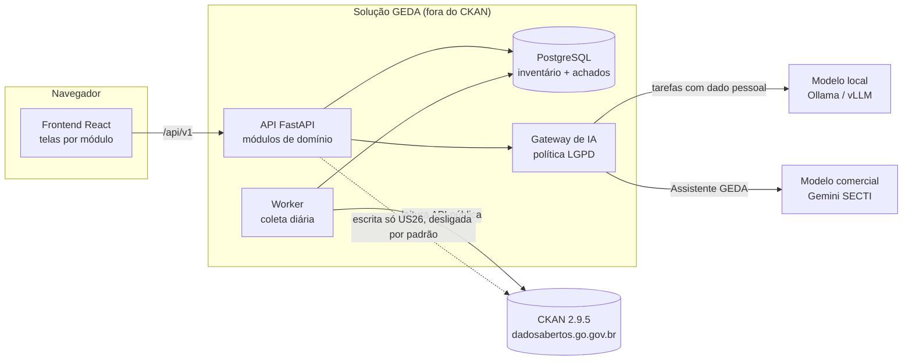

# Arquitetura da solução

Versão 0.2 — 30/09/2026 · PBI-05 (US4) · proposta para validação do time

Detalhes de cada módulo (telas, API, métodos, interações): [docs/modulos/](modulos/README.md).

## 1. Visão geral

A solução é um **monólito modular**: um único backend e um único frontend, organizados
internamente em módulos independentes que espelham as telas do Protótipo V1 e os eixos do
projeto. Isso dá ao time o isolamento necessário para os Eixos 1 e 2 avançarem em paralelo, sem o
custo operacional de microsserviços — compatível com a restrição de infraestrutura leve do PGP v2.



## 2. Decisões principais

| # | Decisão | Por quê | ADR |
|---|---|---|---|
| 1 | Monólito modular, Python/FastAPI + React/TS | Um deploy, módulos isolados, Python já usado pela GEDA e pelo CKAN | [0001](adr/0001-monolito-modular.md) |
| 2 | IA atrás de um gateway, com perfis configuráveis por tela | Trocar Gemini ↔ local sem código; proteger dado pessoal | [0002](adr/0002-camada-ia-plugavel.md) |
| 3 | Frontend reaproveita o CSS do Protótipo V1 sem alteração | Fidelidade ao que a CGE-GO validou em 17/09 | [0003](adr/0003-frontend-modular.md) |
| 4 | Aplicação independente do CKAN, regras de domínio puras | Mantém aberta a decisão extensão × acesso pelo portal | [0004](adr/0004-implantacao-independente.md) |
| 5 | Controle de acesso por papéis e permissões, com catálogo central | Telas e ações por usuário; órgãos só veem os próprios dados | [0005](adr/0005-controle-de-acesso.md) |

## 3. Backend

Cada módulo em `backend/app/modules/<nome>/` segue o mesmo formato:

| Arquivo | Responsabilidade |
|---|---|
| `__init__.py` | declara `module = BackendModule(...)`: prefixo de rota, jobs, US atendidas |
| `router.py` | endpoints HTTP (camada fina: valida, chama o service, devolve schema) |
| `service.py` | regras de negócio e orquestração; nunca importa FastAPI |
| `models.py` | tabelas SQLAlchemy do módulo |
| `schemas.py` | contratos de entrada/saída (Pydantic) |
| `regras.py` | funções puras, sem banco — reutilizáveis numa extensão CKAN |

O `main.py` monta as rotas lendo `INSTALLED_MODULES`; o `worker.py` agenda os `jobs` declarados.
Incluir um módulo novo não exige alterar nenhum outro arquivo além do registro.

### Mapa módulo × backlog

| Módulo backend | Tela (frontend) | US | Responsável |
|---|---|---|---|
| `acesso` | Login, Usuários e papéis | US24 | João |
| `inventario` | Datasets, botão Atualizar dados | US5, US23 | João |
| `pda` | Monitoramento PDA | US6, US7, US8 | Humberto |
| `atualizacoes` | Atualizações | US9, US10 | Humberto |
| `lgpd` | Dados Pessoais (LGPD) | US11–US13, US26, US27 | Luiza |
| `metadados` | Datasets, Relatórios | US16, US17 | Luiza / João |
| `rastreabilidade` | Rastreabilidade | US14, US29 | João / Humberto |
| `painel` | Dashboard, Organizações | US19 | João |
| `relatorios` | Relatórios | US20 | João |
| `assistente` | Assistente GEDA (botão flutuante) | US28 | Luiza |
| `envio` | Envio de dados do órgão | — (não comprometido) | — |
| `ia` | Administração › Modelos de IA | US11, US28 | Luiza |
| `parametros` | Administração › Parâmetros | US8, US11, US16, US17 | — |

`acesso`, `inventario`, `ia`, `parametros` e `assistente` já estão implementados; os demais têm
contratos (`service.py`) com assinaturas e referência aos PBIs, prontos para os eixos.

### Fluxo de dados

1. O **worker** executa a coleta diária (`GDA_COLETA_CRON`, padrão 03:00). O gestor também pode
   forçar uma coleta pelo botão *Atualizar dados* (PBI-74); coletas simultâneas são bloqueadas.
2. A coleta grava o **estado atual** (`organizacao`, `dataset`, `recurso`) e uma **fotografia por
   dataset** (`dataset_snapshot`) — a comparação entre fotografias é a base do diff da
   rastreabilidade, se esta for a opção escolhida na US29.
3. Os módulos de indicadores leem apenas o banco local, nunca o CKAN em tempo de requisição. As
   telas ficam rápidas e não sobrecarregam o portal.

Regras já decididas e embutidas no código: vínculo sempre pelo **ID do dataset**; atualização
pelo **`last_modified` do recurso**; dicionário de dados fora da contagem.

## 4. Camada de IA

```
módulo de negócio ──► AIGateway.chat(tarefa, requisição)
                          │ 1. vínculo da tarefa → perfil principal (+ contingência)
                          │ 2. política: tarefa sensível exige perfil LOCAL
                          │ 3. adaptador do fornecedor (registry)
                          │ 4. falhou? tenta a contingência
                          └ 5. registra uso (sem prompt/resposta)
```

- **Perfil de provedor**: nome + tipo + modelo + URL + chave (cifrada com Fernet) + flag
  *execução local*. Cadastro, teste de conexão e listagem de modelos na página de configuração.
- **Tarefa**: ponto de uso da IA no sistema. Hoje: *Assistente GEDA* (US28, não sensível) e
  *Classificação de dados pessoais* (US11, sensível). Cada tarefa tem principal e contingência.
- **Adaptadores**: `gemini`, `ollama`, `openai_compat` (vLLM, LM Studio, llama.cpp, LocalAI e
  serviços com a mesma API) e `mock`. Um fornecedor novo = um arquivo com `@register_provider`.
- **Política LGPD**: a varredura de dados pessoais funciona primeiro por **regras
  determinísticas** (dígito verificador, padrões), sem IA. A IA entra só nas colunas ambíguas e,
  por receber amostras reais, só pode usar modelo local. O Assistente recebe apenas indicadores
  agregados — nunca o conteúdo de achados. A exceção depende de
  `GDA_IA_PERMITIR_EXTERNO_PARA_SENSIVEL=true`, decisão institucional da CGE-GO.
- **Sem banco vetorial**: o Assistente recebe um contexto montado deterministicamente pelo
  backend a partir da última coleta, e o modelo apenas redige a resposta. Atende o risco de
  infraestrutura registrado no PGP v2.

## 5. Frontend

Cada tela é uma pasta em `frontend/src/modules/` com um `index.ts` que declara seção do menu,
rótulo, ícone, rota, módulo de origem, **permissão obrigatória** e US. O `registry.ts` lista os
módulos; o shell monta menu, rotas e título da topbar a partir dele. Telas sem a permissão do
usuário somem do menu e a rota deixa de existir; ele cai na primeira tela permitida.

O CSS do Protótipo V1 está em `design-system/prototipo-v1.css`, copiado sem alteração; ajustes
ficam em `overrides.css`. Ao implementar uma tela, a marcação do protótipo é a especificação.

## 6. Controle de acesso

Modelo: **usuário → papéis → permissões**, com escopo opcional de órgão. Detalhes e matriz
completa em [docs/modulos/acesso.md](modulos/acesso.md); decisão em [ADR 0005](adr/0005-controle-de-acesso.md).

```
backend/app/core/permissoes.py   catálogo (enum P) + papéis padrão  ← fonte única
        │                                   │
        ▼                                   ▼ scripts/gerar_permissoes_ts.py
backend/app/core/deps.py           frontend/src/shared/acesso/permissoes.gen.ts
require(P.X) em toda rota          permissao obrigatória em todo manifesto de tela
filtrar_por_orgao(...)             <Pode permissao="..."> nos botões
```

- **Ver** um módulo = `<modulo>.acessar` (menu e rota). **Fazer** algo = permissão de ação
  (`inventario.coletar`, `lgpd.aprovar_correcao`, `envio.enviar_recurso`...).
- **Papéis padrão:** Administrador, Gerência GEDA, Equipe GEDA, Superintendência e Órgão
  publicador (este exige órgão). A GEDA pode criar papéis e ajustar permissões na tela.
- **Escopo de órgão:** usuário com órgão vinculado só vê dados daquele órgão.
- **Garantias automáticas:** a API não sobe com rota sem controle de acesso; tela sem permissão não
  compila; testes falham se o catálogo e o TypeScript divergirem.
- Permissões lidas do banco a cada requisição (revogação imediata); JWT só com a identidade,
  expira em 8 h; senhas com bcrypt; segredos de IA cifrados; o sistema impede ficar sem administrador.
- A escrita no CKAN exige três condições simultâneas: `GDA_CKAN_WRITE_ENABLED=true`, token da GEDA
  e recurso do tipo *upload* — além da permissão `lgpd.aprovar_correcao`.

## 7. Pendências que afetam a arquitetura

| Pendência | Impacto | Com quem |
|---|---|---|
| Decisão extensão CKAN × acesso pelo portal (PBI-102) | Empacotamento final; ver ADR 0004 | Paloma / Júnior |
| Versão do Python nas VMs do CKAN | Se a opção for extensão, as `regras.py` precisam rodar nela | Wagner (SECTI) |
| Chave do Gemini (limite 19/10) | Sem ela, o Assistente usa modelo local ou fica desligado | SECTI via Paloma |
| Servidor para modelo local | Onde roda o Ollama/vLLM em produção (CPU/GPU, memória) | Wagner (SECTI) |
| Fonte da rastreabilidade (US29, PBI-70) | Diff de snapshots já suportado; activity stream exige acesso interno | João |
| Órgãos enviando recursos pela solução | Fora do escopo do PGP v2; módulo `envio` existe só como esqueleto | Paloma / Júnior / Wagner |
