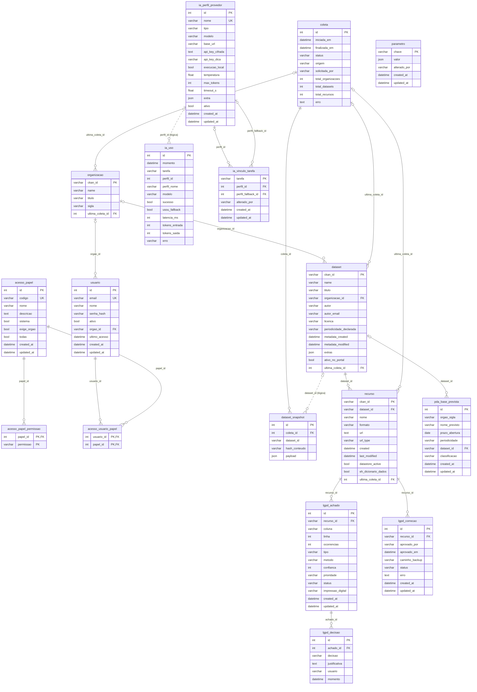

# MER — Modelo Entidade-Relacionamento

> **Arquivo gerado** por `scripts/gerar_mer.py` a partir dos modelos SQLAlchemy.
> Não edite à mão: altere o modelo (ou sua docstring), crie a migração e rode o script.
> Convenções de modelagem: [convencoes.md](convencoes.md) · Decisão: [ADR-0013](../adr/0013-banco-de-dados-e-convencoes.md).

17 tabelas · linhas contínuas = chave estrangeira · linhas tracejadas = referência lógica sem FK (ver tabela ao final).

## Diagrama

## Relacionamentos

| Origem | Destino | Cardinalidade (pai : filhos) | Tipo | Observação |
|---|---|---|---|---|
| `acesso_papel_permissao.papel_id` | `acesso_papel.id` | 1 : N | FK |  |
| `acesso_usuario_papel.usuario_id` | `usuario.id` | 1 : N | FK |  |
| `acesso_usuario_papel.papel_id` | `acesso_papel.id` | 1 : N | FK |  |
| `usuario.orgao_id` | `organizacao.ckan_id` | 0..1 : N | FK |  |
| `dataset.organizacao_id` | `organizacao.ckan_id` | 0..1 : N | FK |  |
| `dataset.ultima_coleta_id` | `coleta.id` | 0..1 : N | FK |  |
| `dataset_snapshot.coleta_id` | `coleta.id` | 1 : N | FK |  |
| `organizacao.ultima_coleta_id` | `coleta.id` | 0..1 : N | FK |  |
| `recurso.dataset_id` | `dataset.ckan_id` | 1 : N | FK |  |
| `recurso.ultima_coleta_id` | `coleta.id` | 0..1 : N | FK |  |
| `pda_base_prevista.dataset_id` | `dataset.ckan_id` | 0..1 : N | FK |  |
| `lgpd_achado.recurso_id` | `recurso.ckan_id` | 1 : N | FK |  |
| `lgpd_correcao.recurso_id` | `recurso.ckan_id` | 1 : N | FK |  |
| `lgpd_decisao.achado_id` | `lgpd_achado.id` | 1 : N | FK |  |
| `ia_vinculo_tarefa.perfil_id` | `ia_perfil_provedor.id` | 0..1 : N | FK |  |
| `ia_vinculo_tarefa.perfil_fallback_id` | `ia_perfil_provedor.id` | 0..1 : N | FK |  |
| `dataset_snapshot.dataset_id` | `dataset.ckan_id` | — | referência lógica | Fotografia histórica: sem FK para não depender do estado atual do dataset. |
| `ia_uso.perfil_id` | `ia_perfil_provedor.id` | — | referência lógica | Registro de uso sobrevive à exclusão do perfil (o nome fica em perfil_nome). |
| `coleta.solicitada_por` | `usuario.email` | — | referência lógica | Autoria congelada como e-mail. |
| `lgpd_decisao.usuario` | `usuario.email` | — | referência lógica | Autoria congelada como e-mail. |
| `lgpd_correcao.aprovado_por` | `usuario.email` | — | referência lógica | Autoria congelada como e-mail. |
| `ia_vinculo_tarefa.alterado_por` | `usuario.email` | — | referência lógica | Autoria congelada como e-mail. |
| `parametro.alterado_por` | `usuario.email` | — | referência lógica | Autoria congelada como e-mail. |

## Dicionário de dados

### Módulo `acesso` — Acesso (usuários e papéis)
Documentação do módulo: [docs/modulos/acesso.md](../modulos/acesso.md)

#### `acesso_papel`

Conjunto nomeado de permissões atribuível a usuários (ex.: Gerência GEDA).

| Coluna | Tipo | Nulo | Chave | Referência | Padrão |
|---|---|:-:|---|---|---|
| `id` | int | não | PK |  |  |
| `codigo` | varchar(60) | não | UK |  |  |
| `nome` | varchar(120) | não |  |  |  |
| `descricao` | text | sim |  |  |  |
| `sistema` | bool | não |  |  | `False` |
| `exige_orgao` | bool | não |  |  | `False` |
| `todas` | bool | não |  |  | `False` |
| `created_at` | datetime | não |  |  | função |
| `updated_at` | datetime | não |  |  | função |

#### `acesso_papel_permissao`

Código de permissão do catálogo (app/core/permissoes.py) concedido a um papel.

| Coluna | Tipo | Nulo | Chave | Referência | Padrão |
|---|---|:-:|---|---|---|
| `papel_id` | int | não | PK, FK | `acesso_papel.id` |  |
| `permissao` | varchar(80) | não | PK |  |  |

#### `acesso_usuario_papel`

Associação N:N entre `usuario` e `acesso_papel`.

| Coluna | Tipo | Nulo | Chave | Referência | Padrão |
|---|---|:-:|---|---|---|
| `usuario_id` | int | não | PK, FK | `usuario.id` |  |
| `papel_id` | int | não | PK, FK | `acesso_papel.id` |  |

#### `usuario`

Pessoa com acesso à solução; com órgão vinculado, fica restrita aos dados dele.

| Coluna | Tipo | Nulo | Chave | Referência | Padrão |
|---|---|:-:|---|---|---|
| `id` | int | não | PK |  |  |
| `email` | varchar(200) | não | UK |  |  |
| `nome` | varchar(200) | não |  |  |  |
| `senha_hash` | varchar(200) | não |  |  |  |
| `ativo` | bool | não |  |  | `True` |
| `orgao_id` | varchar(64) | sim | FK | `organizacao.ckan_id` |  |
| `ultimo_acesso` | datetime | sim |  |  |  |
| `created_at` | datetime | não |  |  | função |
| `updated_at` | datetime | não |  |  | função |

Índices: `ix_usuario_email`

### Módulo `inventario` — Inventário CKAN
Documentação do módulo: [docs/modulos/inventario.md](../modulos/inventario.md)

#### `coleta`

Execução da coleta do CKAN (agendada ou manual), com totais e eventual erro.

| Coluna | Tipo | Nulo | Chave | Referência | Padrão |
|---|---|:-:|---|---|---|
| `id` | int | não | PK |  |  |
| `iniciada_em` | datetime | não |  |  | função |
| `finalizada_em` | datetime | sim |  |  |  |
| `status` | varchar(20) | não |  |  | `'executando'` |
| `origem` | varchar(20) | não |  |  | `'agendada'` |
| `solicitada_por` | varchar(200) | sim |  |  |  |
| `total_organizacoes` | int | não |  |  | `0` |
| `total_datasets` | int | não |  |  | `0` |
| `total_recursos` | int | não |  |  | `0` |
| `erro` | text | sim |  |  |  |

#### `dataset`

Conjunto de dados espelhado do CKAN (package), no estado da última coleta.

| Coluna | Tipo | Nulo | Chave | Referência | Padrão |
|---|---|:-:|---|---|---|
| `ckan_id` | varchar(64) | não | PK |  |  |
| `name` | varchar(200) | não |  |  |  |
| `titulo` | varchar(500) | não |  |  |  |
| `organizacao_id` | varchar(64) | sim | FK | `organizacao.ckan_id` |  |
| `autor` | varchar(300) | sim |  |  |  |
| `autor_email` | varchar(300) | sim |  |  |  |
| `licenca` | varchar(100) | sim |  |  |  |
| `periodicidade_declarada` | varchar(100) | sim |  |  |  |
| `metadata_created` | datetime | sim |  |  |  |
| `metadata_modified` | datetime | sim |  |  |  |
| `extras` | json | não |  |  | função |
| `ativo_no_portal` | bool | não |  |  | `True` |
| `ultima_coleta_id` | int | sim | FK | `coleta.id` |  |

Índices: `ix_dataset_name`, `ix_dataset_organizacao_id`

#### `dataset_snapshot`

Fotografia compacta de um dataset em uma coleta — insumo do diff entre coletas.

| Coluna | Tipo | Nulo | Chave | Referência | Padrão |
|---|---|:-:|---|---|---|
| `id` | int | não | PK |  |  |
| `coleta_id` | int | não | FK | `coleta.id` |  |
| `dataset_id` | varchar(64) | não |  |  |  |
| `hash_conteudo` | varchar(64) | não |  |  |  |
| `payload` | json | não |  |  |  |

Índices: `ix_dataset_snapshot_coleta_id`, `ix_dataset_snapshot_dataset_id`

#### `organizacao`

Órgão publicador espelhado do CKAN (organization).

| Coluna | Tipo | Nulo | Chave | Referência | Padrão |
|---|---|:-:|---|---|---|
| `ckan_id` | varchar(64) | não | PK |  |  |
| `name` | varchar(200) | não |  |  |  |
| `titulo` | varchar(300) | não |  |  |  |
| `sigla` | varchar(40) | sim |  |  |  |
| `ultima_coleta_id` | int | sim | FK | `coleta.id` |  |

Índices: `ix_organizacao_name`

#### `recurso`

Arquivo ou link de um dataset (resource); last_modified é o indicador de atualização.

| Coluna | Tipo | Nulo | Chave | Referência | Padrão |
|---|---|:-:|---|---|---|
| `ckan_id` | varchar(64) | não | PK |  |  |
| `dataset_id` | varchar(64) | não | FK | `dataset.ckan_id` |  |
| `nome` | varchar(500) | sim |  |  |  |
| `formato` | varchar(40) | sim |  |  |  |
| `url` | text | sim |  |  |  |
| `url_type` | varchar(20) | sim |  |  |  |
| `created` | datetime | sim |  |  |  |
| `last_modified` | datetime | sim |  |  |  |
| `datastore_active` | bool | não |  |  | `False` |
| `eh_dicionario_dados` | bool | não |  |  | `False` |
| `ultima_coleta_id` | int | sim | FK | `coleta.id` |  |

Índices: `ix_recurso_dataset_id`

### Módulo `pda` — PDA
Documentação do módulo: [docs/modulos/pda.md](../modulos/pda.md)

#### `pda_base_prevista`

Linha do PDA 2025/2027. O vínculo com o CKAN é SEMPRE pelo ID do dataset (PBI-13).

| Coluna | Tipo | Nulo | Chave | Referência | Padrão |
|---|---|:-:|---|---|---|
| `id` | int | não | PK |  |  |
| `orgao_sigla` | varchar(40) | não |  |  |  |
| `nome_previsto` | varchar(500) | não |  |  |  |
| `prazo_abertura` | date | sim |  |  |  |
| `periodicidade` | varchar(40) | sim |  |  |  |
| `dataset_id` | varchar(64) | sim | FK | `dataset.ckan_id` |  |
| `classificacao` | varchar(20) | não |  |  | `'pda'` |
| `created_at` | datetime | não |  |  | função |
| `updated_at` | datetime | não |  |  | função |

Índices: `ix_pda_base_prevista_dataset_id`, `ix_pda_base_prevista_orgao_sigla`

### Módulo `lgpd` — LGPD
Documentação do módulo: [docs/modulos/lgpd.md](../modulos/lgpd.md)

#### `lgpd_achado`

Possível dado pessoal localizado num recurso (local e tipo, nunca o valor).

| Coluna | Tipo | Nulo | Chave | Referência | Padrão |
|---|---|:-:|---|---|---|
| `id` | int | não | PK |  |  |
| `recurso_id` | varchar(64) | não | FK | `recurso.ckan_id` |  |
| `coluna` | varchar(300) | não |  |  |  |
| `linha` | int | sim |  |  |  |
| `ocorrencias` | int | não |  |  | `1` |
| `tipo` | varchar(40) | não |  |  |  |
| `metodo` | varchar(20) | não |  |  |  |
| `confianca` | int | não |  |  |  |
| `prioridade` | varchar(10) | não |  |  |  |
| `status` | varchar(20) | não |  |  | `'revisar'` |
| `impressao_digital` | varchar(64) | não |  |  |  |
| `created_at` | datetime | não |  |  | função |
| `updated_at` | datetime | não |  |  | função |

Índices: `ix_lgpd_achado_impressao_digital`, `ix_lgpd_achado_recurso_id`

#### `lgpd_correcao`

Trilha da anonimização publicada no CKAN (PBI-92 a PBI-94).

| Coluna | Tipo | Nulo | Chave | Referência | Padrão |
|---|---|:-:|---|---|---|
| `id` | int | não | PK |  |  |
| `recurso_id` | varchar(64) | não | FK | `recurso.ckan_id` |  |
| `aprovado_por` | varchar(200) | não |  |  |  |
| `aprovado_em` | datetime | não |  |  |  |
| `caminho_backup` | varchar(500) | não |  |  |  |
| `status` | varchar(20) | não |  |  | `'pendente'` |
| `erro` | text | sim |  |  |  |
| `created_at` | datetime | não |  |  | função |
| `updated_at` | datetime | não |  |  | função |

Índices: `ix_lgpd_correcao_recurso_id`

#### `lgpd_decisao`

Histórico imutável das decisões humanas (PBI-42).

| Coluna | Tipo | Nulo | Chave | Referência | Padrão |
|---|---|:-:|---|---|---|
| `id` | int | não | PK |  |  |
| `achado_id` | int | não | FK | `lgpd_achado.id` |  |
| `decisao` | varchar(20) | não |  |  |  |
| `justificativa` | text | sim |  |  |  |
| `usuario` | varchar(200) | não |  |  |  |
| `momento` | datetime | não |  |  |  |

Índices: `ix_lgpd_decisao_achado_id`

### Módulo `ia` — Modelos de IA
Documentação do módulo: [docs/modulos/ia.md](../modulos/ia.md)

#### `ia_perfil_provedor`

Uma configuração nomeada de provedor+modelo. Ex.: 'Gemini SECTI', 'Qwen local'.

| Coluna | Tipo | Nulo | Chave | Referência | Padrão |
|---|---|:-:|---|---|---|
| `id` | int | não | PK |  |  |
| `nome` | varchar(120) | não | UK |  |  |
| `tipo` | varchar(40) | não |  |  |  |
| `modelo` | varchar(200) | não |  |  |  |
| `base_url` | varchar(500) | sim |  |  |  |
| `api_key_cifrada` | text | sim |  |  |  |
| `api_key_dica` | varchar(20) | sim |  |  |  |
| `execucao_local` | bool | não |  |  | `False` |
| `temperatura` | float | não |  |  | `0.2` |
| `max_tokens` | int | não |  |  | `1024` |
| `timeout_s` | float | não |  |  | `60.0` |
| `extra` | json | não |  |  | função |
| `ativo` | bool | não |  |  | `True` |
| `created_at` | datetime | não |  |  | função |
| `updated_at` | datetime | não |  |  | função |

#### `ia_uso`

Uma linha por chamada. NÃO guarda prompt nem resposta (PBI-35 — não retenção).

| Coluna | Tipo | Nulo | Chave | Referência | Padrão |
|---|---|:-:|---|---|---|
| `id` | int | não | PK |  |  |
| `momento` | datetime | não |  |  | função |
| `tarefa` | varchar(40) | não |  |  |  |
| `perfil_id` | int | sim |  |  |  |
| `perfil_nome` | varchar(120) | não |  |  |  |
| `modelo` | varchar(200) | não |  |  |  |
| `sucesso` | bool | não |  |  |  |
| `usou_fallback` | bool | não |  |  | `False` |
| `latencia_ms` | int | sim |  |  |  |
| `tokens_entrada` | int | sim |  |  |  |
| `tokens_saida` | int | sim |  |  |  |
| `erro` | varchar(500) | sim |  |  |  |

Índices: `ix_ia_uso_momento`

#### `ia_vinculo_tarefa`

Qual perfil atende cada tarefa de IA (e qual assume se o principal falhar).

| Coluna | Tipo | Nulo | Chave | Referência | Padrão |
|---|---|:-:|---|---|---|
| `tarefa` | varchar(40) | não | PK |  |  |
| `perfil_id` | int | sim | FK | `ia_perfil_provedor.id` |  |
| `perfil_fallback_id` | int | sim | FK | `ia_perfil_provedor.id` |  |
| `alterado_por` | varchar(200) | sim |  |  |  |
| `created_at` | datetime | não |  |  | função |
| `updated_at` | datetime | não |  |  | função |

### Módulo `parametros` — Parâmetros
Documentação do módulo: [docs/modulos/parametros.md](../modulos/parametros.md)

#### `parametro`

Valor de negócio editável pela GEDA; ausente no banco = vale o padrão do catálogo.

| Coluna | Tipo | Nulo | Chave | Referência | Padrão |
|---|---|:-:|---|---|---|
| `chave` | varchar(80) | não | PK |  |  |
| `valor` | json | não |  |  |  |
| `alterado_por` | varchar(200) | sim |  |  |  |
| `created_at` | datetime | não |  |  | função |
| `updated_at` | datetime | não |  |  | função |
