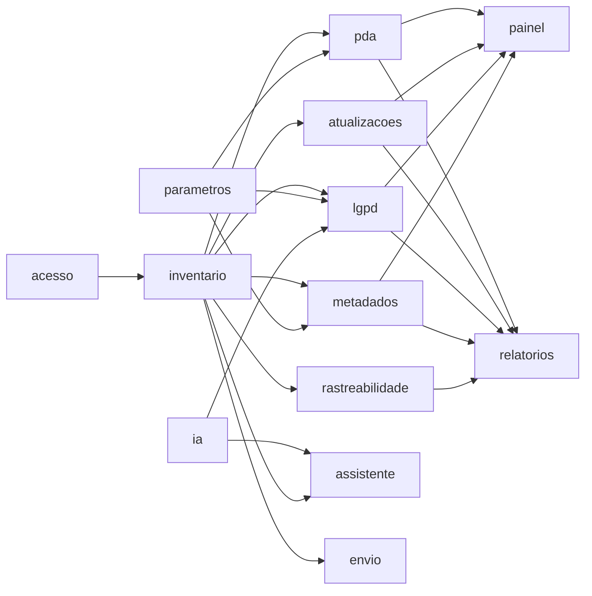

# Documentação dos módulos

Um arquivo por módulo, no formato de [`_MODELO.md`](_MODELO.md). **Regra do projeto (AGENTS.md):
toda alteração em um módulo atualiza o arquivo dele no mesmo commit**, incluindo uma linha no
Histórico. O hook `.githooks/pre-commit` e o teste `test_guardas_do_projeto.py` verificam isso.

| Módulo | Telas | Status | Responsável |
|---|---|---|---|
| [acesso](acesso.md) | Login, Usuários e papéis | Implementado | João |
| [inventario](inventario.md) | Datasets, botão Atualizar dados | Implementado (tela: esqueleto) | João |
| [pda](pda.md) | Monitoramento PDA | Esqueleto | Humberto |
| [atualizacoes](atualizacoes.md) | Atualizações | Esqueleto | Humberto |
| [lgpd](lgpd.md) | Dados Pessoais (LGPD) | Parcial | Luiza |
| [metadados](metadados.md) | — (alimenta Datasets e Relatórios) | Esqueleto | Luiza / João |
| [rastreabilidade](rastreabilidade.md) | Rastreabilidade | Esqueleto | João / Humberto |
| [painel](painel.md) | Dashboard, Organizações | Esqueleto | João |
| [relatorios](relatorios.md) | Relatórios | Esqueleto | João |
| [assistente](assistente.md) | Assistente GEDA (botão flutuante) | Implementado | Luiza |
| [envio](envio.md) | Envio de dados do órgão | Não comprometido | — |
| [ia](ia.md) | Modelos de IA | Implementado | Luiza |
| [parametros](parametros.md) | Parâmetros | Implementado | — |

## Mapa de dependências

Seta `A --> B` = B usa dados ou serviços de A. Todos os módulos dependem de `acesso` pelo portão
de permissões (`app/core/deps.py`); essa dependência não está desenhada para não poluir o mapa.
